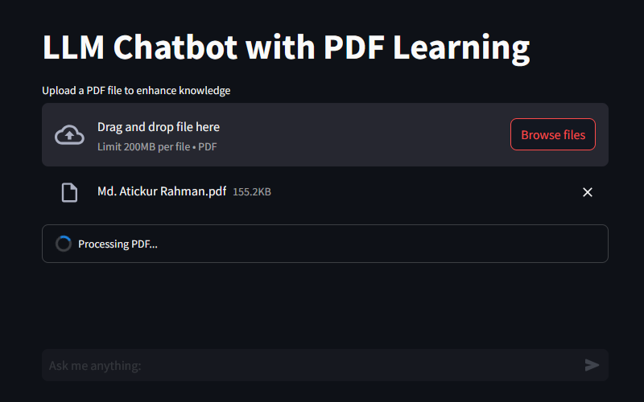
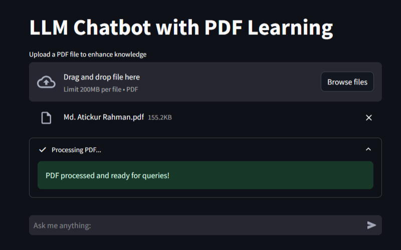
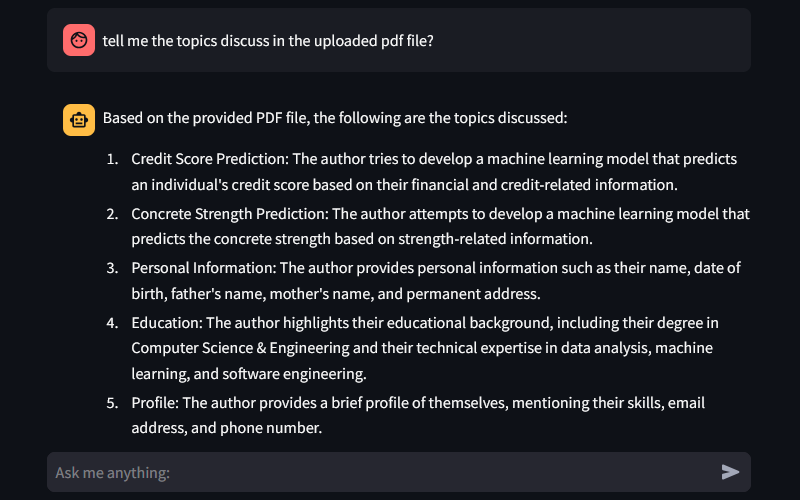

# LLM Chatbot with PDF Learning

## Overview

<p align="center">
  
  
</p>
<p align="center">
  
</p>

This project implements an **LLM-powered chatbot** that can answer general queries and learn from user-uploaded PDFs. If the chatbot cannot answer a question based on its initial knowledge, users can upload a **PDF document**, and the chatbot will process and use its content to improve responses.

## Features

- **Conversational AI:** Uses **LLaMA 2** via **Ollama** for intelligent responses.
- **Memory Retention:** Stores and recalls chat history.
- **PDF Learning:** Users can upload PDFs to enhance the chatbot’s knowledge.
- **Vector Database Integration:** Uses **ChromaDB** for efficient document retrieval.
- **Streamlit UI:** Provides an interactive web interface.

## Installation

1. **Clone the Repository:**
```
git clone https://github.com/Fardins/LLM-Chatbot-with-PDF-Learning.git
cd llm-chatbot
```
2. **Create a Virtual Environment (Optional but Recommended):**
```
python -m venv .venv
source .venv/bin/activate  # On Windows use: .venv\Scripts\activate
```

3. **Install Dependencies:**
```
pip install -r requirements.txt
```

## Usage

### Run the Chatbot
```
streamlit run app.py
```

### Uploading a PDF
1. Click **"Upload a PDF file to enhance knowledge"**.
2. Select a **.pdf** file.
3. The chatbot will process the document and use it to answer queries.

### Asking Questions
- Type a question in the input box.
- If the chatbot knows the answer, it responds immediately.
- If not, upload a relevant PDF to improve its knowledge base.

## Project Structure
```
llm-chatbot/
│── pdfFiles/                  # Stores uploaded PDFs
│── vectorDB/                  # Persistent vector database storage
│── app.py                     # Main chatbot application
│── requirements.txt           # Python dependencies
│── README.md                  # Project documentation
```

## Dependencies
- **Python 3.8+**
- **Streamlit** (For UI)
- **LangChain** (For LLM integration)
- **ChromaDB** (For vector storage)
- **Ollama** (For LLaMA 2 model inference)
- **PyPDFLoader** (For PDF processing)

## Troubleshooting
### Common Issues & Fixes

1. **ChromaDB Errors** (e.g., hnswlib.Index.file_handle_count)
```
pip install --upgrade chromadb hnswlib
```
If issues persist, downgrade **hnswlib**:
```
pip install hnswlib==0.7.0
```

2. **LLaMA 2 Not Loading**
Ensure `Ollama` is installed and running:
```
pip install ollama
ollama pull llama2
```

3. **Streamlit App Not Starting**
Check your Python version:
```
python --version  # Must be 3.8 or higher
```
If `ModuleNotFoundError`, reinstall dependencies:
```
pip install -r requirements.txt
```

## Future Enhancements
- Support for multiple PDFs.
- Integration with RAG (Retrieval-Augmented Generation).
- Deployment on Hugging Face Spaces / AWS.